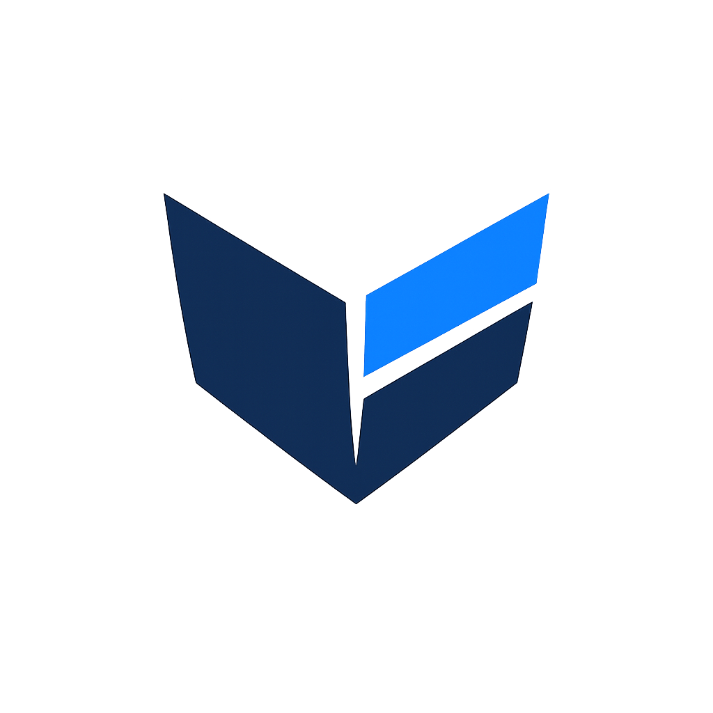

<p align="center">
  
</p>

<h1 align="center">Keel</h1>

<p align="center">
  <strong>The full-stack foundation for web + mobile apps.</strong><br/>
  Auth, database, email, mobile — ready in one command.
</p>

<p align="center">
  
  
  
  
  
</p>

<p align="center">
  <sub>a <a href="https://codai.app"></a> project</sub>
</p>

---

## What You Get

| Layer | Stack |
|-------|-------|
| **Frontend** | Vite + React 19 + TypeScript + TailwindCSS v4 |
| **Backend** | Express 5 + TypeScript (ESM) |
| **Auth** | BetterAuth — email/password, sessions, email verification |
| **Email** | Resend + React Email — verification, welcome, password reset |
| **Database** | PostgreSQL + Drizzle ORM (migrations) |
| **Mobile** | Capacitor 8 — iOS + Android via WebView |
| **Hosting** | Docker, Fly.io, Railway, Vercel, or self-hosted |

## Quick Start

```bash
# Create a new project
npx keel create my-app

# Follow the setup wizard — it configures everything:
#   → Project name & branding
#   → Database connection
#   → Auth secrets
#   → Email provider (optional)
#   → Which sails to install
```

### Zero-Config Start (no Docker needed)

```bash
npx keel create my-app --yes --db=pglite
cd my-app
keel dev
```

Uses PGlite (embedded PostgreSQL via WASM) — full PostgreSQL compatibility without Docker.

### Manual Setup (from this repo)

```bash
git clone https://github.com/Chafficui/keel.git my-app
cd my-app
npm install

# Start PostgreSQL
docker compose up -d

# Copy environment files
cp packages/backend/.env.example packages/backend/.env
# Edit .env with your database URL, secrets, etc.

# Run database migrations
npm run db:migrate

# Start development
npm run dev
```

## Project Structure

```
packages/
  shared/      → @keel/shared    — Types + Zod validators
  email/       → @keel/email     — React Email templates
  frontend/    → @keel/frontend  — Vite + React SPA + Capacitor
  backend/     → @keel/backend   — Express 5 API server
sails/         → Tracks installed sails (minimal, no code shipped)
cli/           → create-keel CLI + sail definitions
docs/          → Architecture, auth flow, mobile, sail development guides
brand/         → Keel brand assets + design guide
```

## Development

```bash
npm run dev               # Frontend (:5173) + Backend (:3005) concurrently
npm run dev:frontend      # Frontend only
npm run dev:backend       # Backend only
npm run dev:email         # Email template preview (:3010)
```

### Database

```bash
npm run db:generate       # Generate migration from schema changes
npm run db:migrate        # Apply pending migrations
npm run db:push           # Push schema directly (dev only)
npm run db:studio         # Open Drizzle Studio GUI
```

### Mobile (Capacitor)

```bash
npm run cap:sync          # Sync web build to native projects
npm run cap:ios           # Open iOS project
npm run cap:android       # Open Android project
```

### Build & Deploy

```bash
npm run build             # Build all packages
npm run typecheck         # Type-check everything
keel deploy               # Show deployment guides
```

### Deployment Options

| Platform | Config File | Command |
|----------|------------|---------|
| Docker (self-hosted) | `docker-compose.prod.yml` | `docker compose -f docker-compose.prod.yml up -d` |
| Fly.io | `fly.toml` | `fly launch --copy-config && fly deploy` |
| Railway | `packages/backend/railway.json` | `railway up` |
| Vercel (frontend) | `packages/frontend/vercel.json` | `vercel --cwd packages/frontend` |
| Any container host | `packages/backend/Dockerfile` | `docker build -f packages/backend/Dockerfile -t my-app .` |

## Sails — Extend Your App

Sails are optional packages that add functionality to your Keel project. They're **not** bundled into your app — install only what you need.

```bash
# List available sails
npx keel list

# Install a sail (runs interactive setup wizard)
npx keel sail add google-oauth

# Get info about a sail before installing
npx keel info stripe
```

### Available Sails

| Sail | Category | What it adds |
|------|----------|-------------|
| **google-oauth** | Auth | Google sign-in button + OAuth provider config |
| **stripe** | Payments | Subscriptions, checkout, webhooks, customer portal |
| **gdpr** | Compliance | Consent tracking, data export, account deletion (30-day grace), privacy policy |
| **r2-storage** | Storage | Cloudflare R2 file uploads + profile picture upload component |
| **push-notifications** | Mobile | Firebase Cloud Messaging + device token management |
| **analytics** | Tracking | PostHog — page views, user identification, custom events |
| **admin-dashboard** | Admin | User management, metrics overview |
| **i18n** | Localization | i18next + react-i18next + language detection |
| *rate-limiting* | Security | API rate limiting middleware *(planned)* |
| *file-uploads* | Storage | Generic file upload system *(planned)* |

Every sail includes a **setup wizard** that walks you through configuration, prompts for required env vars, and handles file modifications automatically.

### How Sails Work

Sails use marker comments in your codebase to know where to insert code:

```ts
// [SAIL_IMPORTS]           — import statements
// [SAIL_ROUTES]            — route registrations
// [SAIL_SCHEMA]            — database schema exports
// [SAIL_SOCIAL_PROVIDERS]  — OAuth provider config
// [SAIL_ENV_VARS]          — environment variable declarations
{/* [SAIL_SOCIAL_BUTTONS] */} — social login buttons in forms
```

**If you've modified files** and a marker is missing, the installer won't break your code — it prints clear manual instructions instead.

## Auth System

Keel ships with a complete auth system powered by [BetterAuth](https://better-auth.com):

- **Email/password** registration + login
- **Email verification** (auto-verified in dev mode)
- **Password reset** flow
- **Session management** (HTTP-only cookies for web, Bearer tokens for mobile)
- **Hybrid auth** — detects web vs. Capacitor automatically via `X-Platform` header

### Key Files

| File | Purpose |
|------|---------|
| `backend/src/auth/index.ts` | BetterAuth server config |
| `backend/src/middleware/auth.ts` | Hybrid cookie/Bearer middleware |
| `frontend/src/lib/auth-client.ts` | BetterAuth client config |
| `frontend/src/lib/api.ts` | API client with auto auth headers |

## Email Templates

Built with [React Email](https://react.email) — preview at `localhost:3010` during dev:

- **Verification** — email confirmation link
- **Welcome** — post-verification welcome
- **Password Reset** — reset link

In development, emails log to console and accounts auto-verify. Install the **gdpr** sail for additional templates (deletion, export, consent).

## Environment Variables

### Backend (`packages/backend/.env`)

| Variable | Required | Description |
|----------|----------|-------------|
| `DATABASE_URL` | Yes | PostgreSQL connection string |
| `BETTER_AUTH_SECRET` | Yes | Session signing secret |
| `BACKEND_URL` | Yes | Public backend URL |
| `FRONTEND_URL` | Yes | Public frontend URL |
| `PORT` | No | Server port (default: 3005) |
| `NODE_ENV` | No | development / production |
| `RESEND_API_KEY` | No | Resend API key (logs to console if missing) |
| `EMAIL_FROM` | No | Sender email address |

### Frontend (`packages/frontend/.env`)

| Variable | Description |
|----------|-------------|
| `VITE_API_URL` | Backend URL (empty = use Vite proxy in dev) |
| `VITE_APP_NAME` | App display name |

## Documentation

Detailed guides in the [docs/](docs/) folder:

- [Architecture Overview](docs/architecture.md) — system design, data flow, deployment
- [Auth Flow](docs/auth-flow.md) — registration, login, sessions, token handling
- [Capacitor Guide](docs/capacitor-guide.md) — mobile setup, deep links, native features
- [GDPR Compliance](docs/gdpr-compliance.md) — consent, export, deletion (used by gdpr sail)
- [Sail Development](docs/sail-development.md) — how to build your own sails

## Tech Requirements

- Node.js ≥ 22
- PostgreSQL 16+ (or use the included `docker-compose.yml`)
- npm 10+

---

<p align="center">
  <sub>Built with <a href="https://codai.app"></a></sub>
</p>
